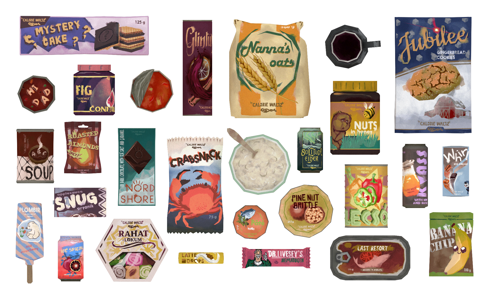

## v1.0
4 new items: Hematogen, Latte Drops, Turkish Delight and Alphabet Soup

Spawn points and lore is now complete, collectible candles are now proper candles

hurray c:

## Foods by 'Calorie Waltz'
Selection of foods I think looks tasty :yum: You can take a closer look in [this video](https://www.youtube.com/watch?v=JeQy1t07uN4) :)

## Description
Some designs came out of my head, some are 'inspired' by others. This food pack is not exactly balanced or anything, I just googled calories for real life analogies and slapped those in. There are options for tweaking calorie values however

All scenes except for Blackrock are covered with custom spawn points

## Collectibles
Includes collectible bear candles that can be found inside every Applesauce Pryanik package. 

One of each bear can be found across the map, you can collect them either that way or from Pryaniks. Or disable collectibles completely if you want pure food mod

**LMB** while holding any flame source to **light the candle**

**LMB** while candle it burning to light a torch(if holding) or **blow out the candle**

Burntime is about **8 hours**, candle will disappear after that(you can keep them as figurines, can be toggled in settings under "Cheating" section)

Candle flame is **affected by wind**

Candle flame **can be shot with weapons**, it will degrade candles quickly though(can be disabled in settings under "Cheating" section)

## Lore

There's also lore that can be unveiled by finding notes across the map. In the process of writing it turned from lore of the mod to just a story of a survivor. I tried making it not very trivial, but I'm not a writer so no idea how it turned out. You can disable it in settings if you don't care about it

## Installation
Unpack the .zip into `.../Mods/`

Requires [ModComponent](https://github.com/ds5678/ModComponent/releases) and [ModSettings](https://github.com/zeobviouslyfakeacc/ModSettings/releases). 

## Shoutout
[@ds5678](https://github.com/ds5678) and modding discord people for helping out, suggesting ideas and giving feedback.
